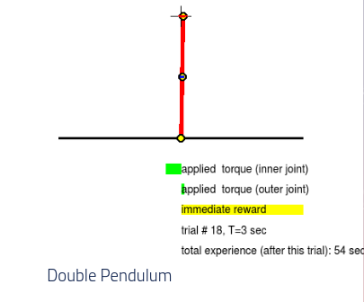
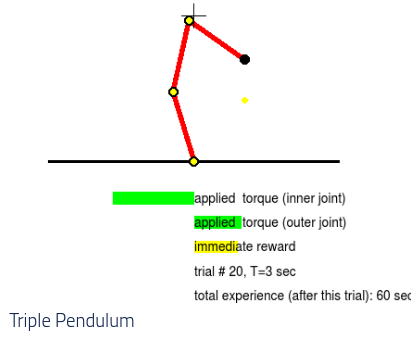
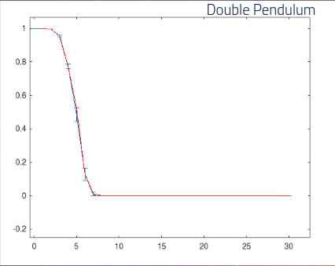
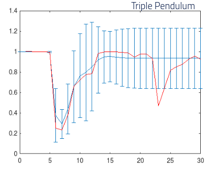
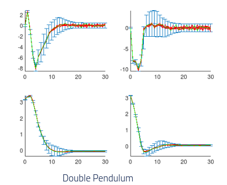
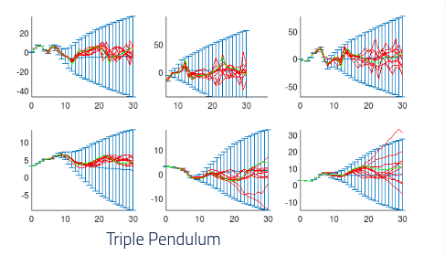
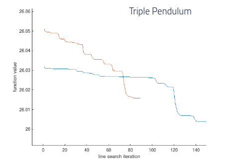

## Applying PILCO Algorithm To The Triple Pendulum

Use [PILCO](http://mlg.eng.cam.ac.uk/pilco/) (Probabilistic Inference for Learning Control) on a triple pendulum system. The model was trained to control the three joints in a triple pendulum, and compared to the training of a double pendulum (after 20 iterations). the model's goal was to control the swinging pendulum such that it remains upright.

# Result

Double pendulum

Triple pendulum

# Cost

Predicted cost - blue
Incurrect cost - red

Double Pendulum

Triple Pendulum

# State Trajectories

Double Pendulum

Triple Pendulum

# Policy Convergence

Triple Pendulum

